# Sơ đồ kiến trúc các hệ thống — Mermaid

> Tài liệu mô tả luồng hoạt động **từng bước** của các hệ thống đã thắng tại HCM AI Challenge + các kiến trúc đề xuất.
> Tất cả diagram đều theo cú pháp Mermaid — render được trên GitHub, VSCode, Obsidian.

## Mục lục

**Các đội đã thi:**
1. [DoppelSearch (2023) — CLIP-only baseline](#1-doppelsearch-2023--clip-only-baseline)
2. [Vi-ATISO (2023) — Microservices 4-channel](#2-vi-atiso-2023--microservices-4-channel)
3. [NaiveNotNice (2024) — Multi-model Ensemble](#3-naivenotnice-2024--multi-model-ensemble)
4. [NewsInsight 2.0 (2024) — BLIP + Elasticsearch + LLM](#4-newsinsight-20-2024--blip--elasticsearch--llm)
5. [VizQuest (2024) — Fusion + Temporal Modeling](#5-vizquest-2024--fusion--temporal-modeling)
6. [SnapSeek (2024) — Milvus + Context-aware](#6-snapseek-2024--milvus--context-aware)
7. [RAPID (URA, SOICT 2024) — BLIP-2 + Translation Bridging](#7-rapid-ura-soict-2024--blip-2--translation-bridging)
8. [TycheVid (Giải Nhất 2024) — Speed-optimized HNSW](#8-tychevid-giải-nhất-2024--speed-optimized-hnsw)

**Kiến trúc đề xuất:**
9. [DMAR — Disentangled Multi-Axis Retrieval](#9-dmar--disentangled-multi-axis-retrieval)
10. [Session Adapter — Online Learning from Clicks](#10-session-adapter--online-learning-from-clicks)
11. [Temporal Event Graph + Synthetic Queries](#11-temporal-event-graph--synthetic-queries)
12. [Combo cuối: BetterDay v2 tổng hợp](#12-combo-cuối-betterday-v2-tổng-hợp)

---

## 1. DoppelSearch (2023) — CLIP-only baseline

> Đơn giản nhất: chỉ CLIP + Faiss. Là baseline mà mọi đội nên hiểu trước khi mở rộng.

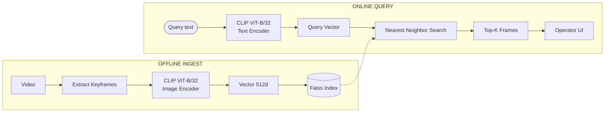

**Các bước:**
1. **Offline**: tách keyframe → CLIP image encoder → vector → đẩy vào Faiss.
2. **Online**: query text → CLIP text encoder → vector → Faiss search → top-K.
3. **Điểm mạnh**: nhanh, đơn giản. **Yếu**: bỏ qua OCR, ASR, temporal.

---

## 2. Vi-ATISO (2023) — Microservices 4-channel

> Kiến trúc microservice: 4 search engine riêng biệt, operator chọn loại search.

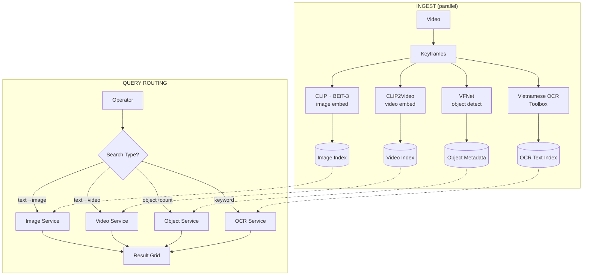

**Các bước:**
1. **Offline**: 4 pipeline song song xử lý keyframe → 4 index riêng.
2. **Online**: operator **chọn loại search** → route đến service tương ứng → trả kết quả.
3. **Điểm mạnh**: linh hoạt, mỗi service tối ưu cho 1 task. **Yếu**: operator phải biết chọn loại search nào.

---

## 3. NaiveNotNice (2024) — Multi-model Ensemble

> "Chia để trị": trích xuất mọi tầng thông tin có thể → fuse khi search.

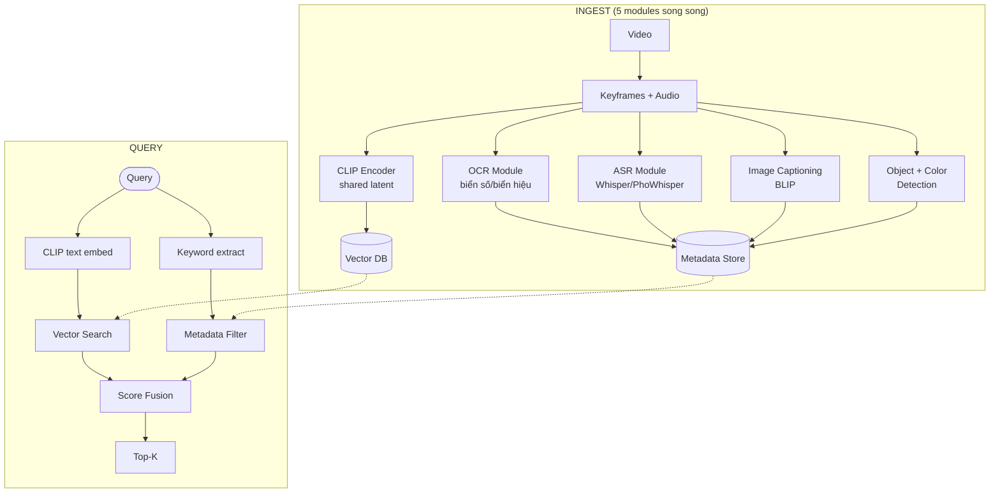

**Các bước:**
1. **Ingest**: chạy 5 module song song → CLIP vector vào Vector DB, OCR/ASR/caption/object vào metadata.
2. **Query**: query → CLIP embed (vector path) + keyword extract (metadata path) → fuse score.
3. **Điểm mạnh**: bao quát nhiều modality. **Yếu**: fusion score đơn giản, không có temporal.

---

## 4. NewsInsight 2.0 (2024) — BLIP + Elasticsearch + LLM

> Kiến trúc 2-stage filter: Elasticsearch lọc thô + BLIP rerank tinh + LLM optimize query.

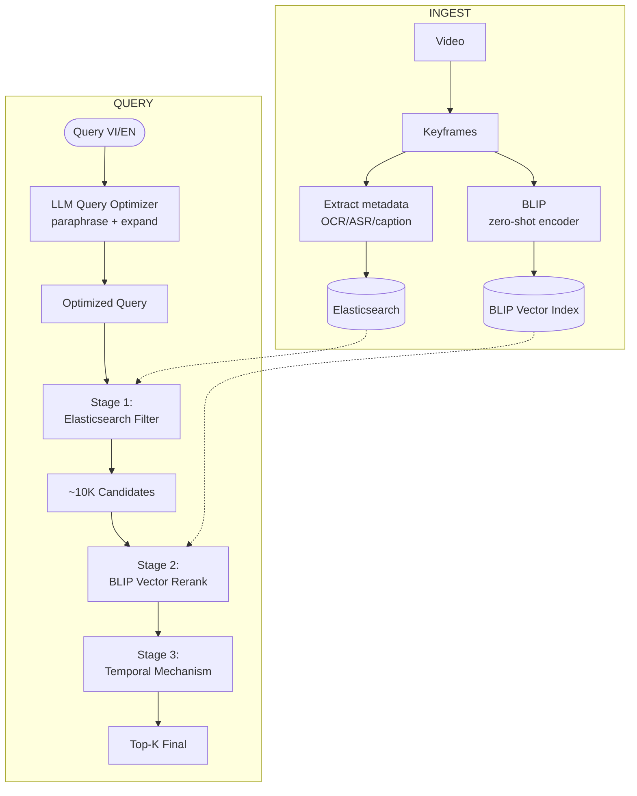

**Các bước:**
1. **Ingest**: BLIP embed → Vector index; metadata text → Elasticsearch.
2. **Query**:
   - LLM nhận query → tinh chỉnh (mở rộng từ đồng nghĩa, thêm ngữ cảnh).
   - Stage 1: ES filter coarse → giảm xuống ~10K candidate.
   - Stage 2: BLIP rerank → giảm xuống top-K.
   - Stage 3: temporal alignment cho chuỗi sự kiện.
3. **Điểm mạnh**: chính xác cao, có LLM giúp xử lý query mơ hồ.

---

## 5. VizQuest (2024) — Fusion + Temporal Modeling

> Top 10. Cốt lõi: fusion 3 modality + temporal cho chuỗi sự kiện.

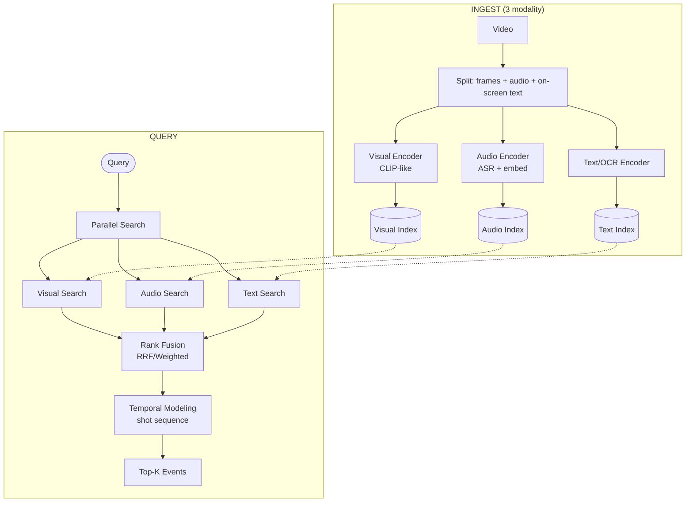

**Các bước:**
1. **Ingest**: tách video thành 3 stream (visual/audio/text) → 3 encoder riêng → 3 index.
2. **Query**: query → 3 search song song → fusion rank.
3. **Bước đặc biệt**: tầng **temporal modeling** ráp các shot liên tiếp thành sự kiện.

---

## 6. SnapSeek (2024) — Milvus + Context-aware

> Milvus (vector DB chuyên dụng) + Elasticsearch + "contextual news extraction" để hiểu ngữ cảnh tin tức.

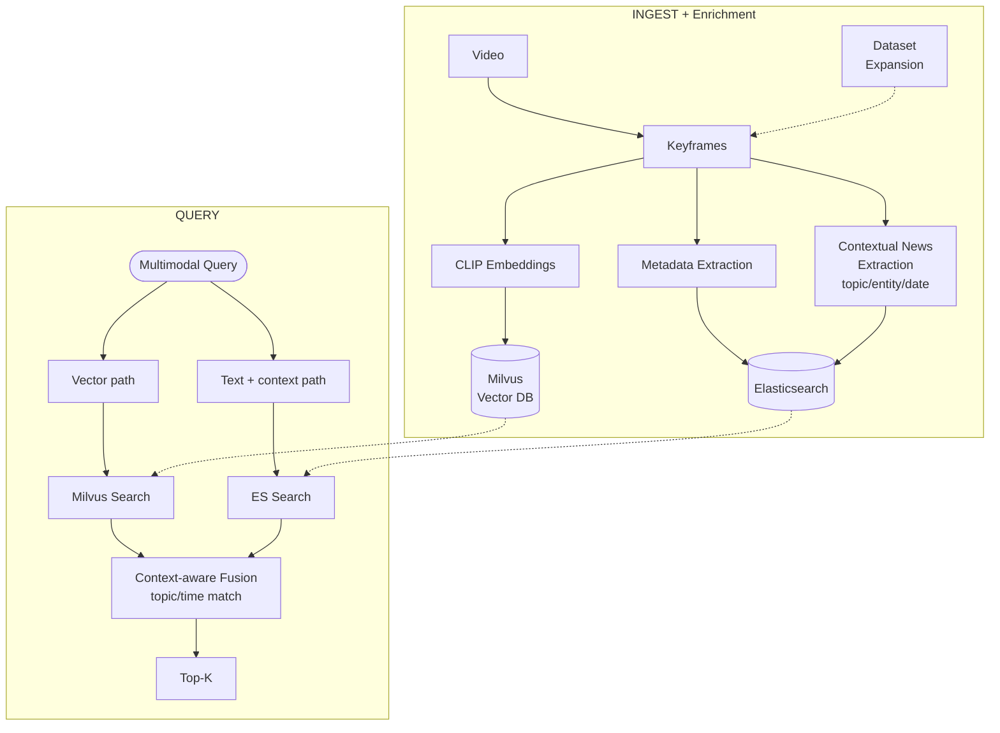

**Các bước:**
1. **Ingest**: thêm bước **enrichment** — trích topic/entity/date từ video (rất hợp với dataset news VN).
2. **Query**: vector path + text/context path → fuse có trọng số ưu tiên match topic và thời gian.
3. **Điểm đặc biệt**: dataset expansion (tự bổ sung dữ liệu ngoài để cải thiện).

---

## 7. RAPID (URA, SOICT 2024) — BLIP-2 + Translation Bridging

> Kiến trúc học thuật mạnh nhất, đã publish. Điểm độc đáo: **dịch tiếng Việt sang tiếng Anh** trước khi đưa vào VLM.

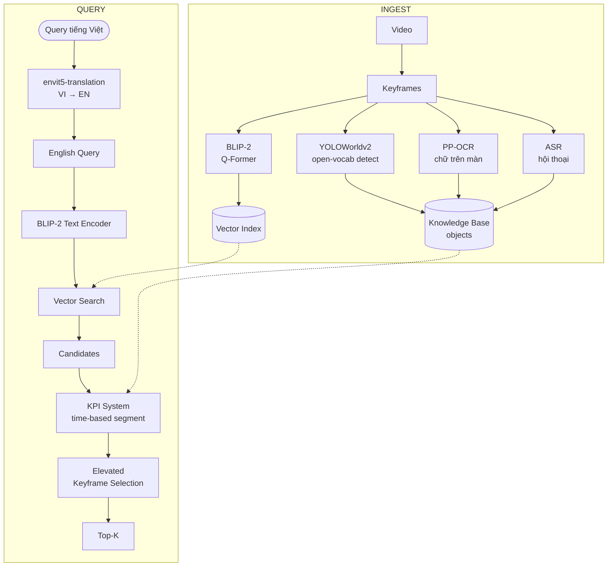

**Các bước:**
1. **Ingest**: BLIP-2 embed + open-vocab object + OCR + ASR → 2 storage (vector + KB).
2. **Query**:
   - **Translation bridge**: query VI → envit5 → EN (tránh VLM mù tiếng Việt).
   - BLIP-2 encode EN query → vector → search.
   - **KPI**: gom shot theo segment thời gian + tổng hợp text/ASR/OCR.
   - **Elevated keyframe**: chọn frame đại diện tốt nhất cho mỗi segment.
3. **Điểm độc đáo**: translation bridging — pattern thực dụng, **bắt buộc** kế thừa nếu làm dataset VN.

---

## 8. TycheVid (Giải Nhất 2024) — Speed-optimized HNSW

> Bí kíp: không sáng tạo về model, mà **siêu nhanh** nhờ tune HNSW. Latency là vũ khí.

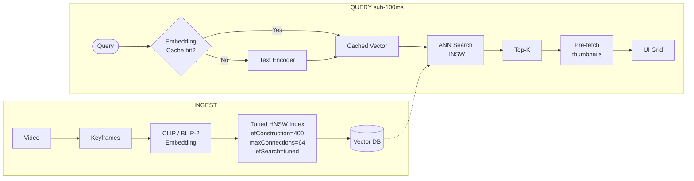

**Các bước:**
1. **Ingest**: tune HNSW params kỹ (`efConstruction`, `maxConnections`) — không default!
2. **Query**:
   - Cache embedding cho query trùng.
   - HNSW search với `efSearch` tối ưu → mili-giây.
   - Pre-fetch thumbnail (predictive load) → UI render tức thì.
3. **Triết lý**: chất lượng thuật toán giữa top đội sát nhau → ai nhanh hơn, operator thử được nhiều query hơn → thắng.

---

## 9. DMAR — Disentangled Multi-Axis Retrieval

> **Đề xuất 1**: thay vì 1 vector/frame, lưu **6 vector song song** đại diện 6 trục ngữ nghĩa độc lập.

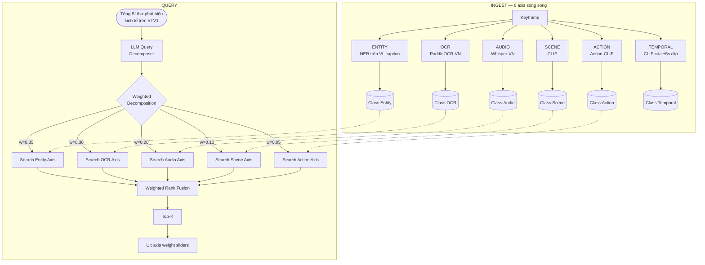

**Các bước:**
1. **Ingest**: 6 encoder song song cho mỗi keyframe → 6 class riêng trong Weaviate.
2. **Query**:
   - LLM phân rã query thành **weighted compositional query** (entity/ocr/audio/...).
   - Search **6 trục** song song với trọng số.
   - Fuse rank theo trọng số.
3. **UI**: operator có thể chỉnh slider trọng số trục → tinh chỉnh kết quả real-time.

---

## 10. Session Adapter — Online Learning from Clicks

> **Đề xuất 2**: hệ thống **tự học từ click ✓/✗ của operator** trong session, không cần gõ lại query.

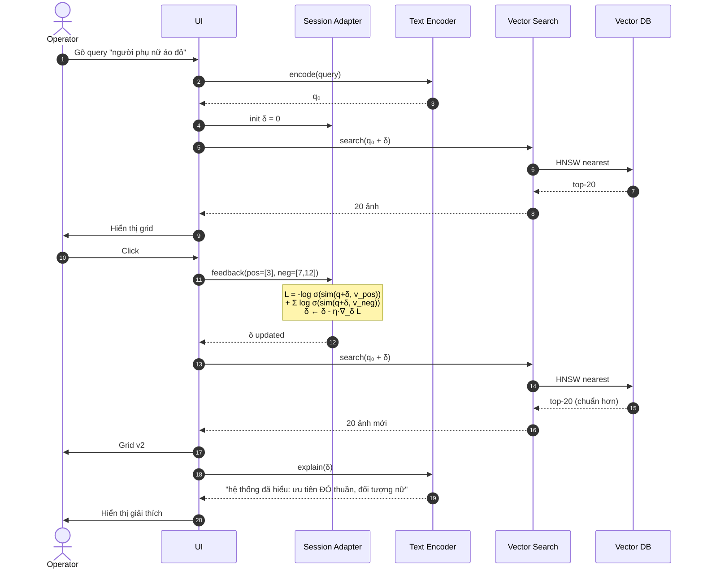

**Các bước (đánh số trong diagram):**
1-5. Initial: operator gõ query, hệ thống embed q₀, search lần đầu, hiển thị.
6-8. Operator click ✓/✗ → adapter tính gradient → cập nhật δ.
9-12. Re-search với q₀+δ → kết quả chính xác hơn.
13-14. (Bonus) LLM giải thích δ đã encode gì → operator hiểu hệ thống "học" gì.

**Điểm đặc biệt**: δ chỉ tồn tại trong session, reset khi sang query mới → an toàn, không drift toàn cục.

---

## 11. Temporal Event Graph + Synthetic Queries

> **Đề xuất 3**: build offline đồ thị thời gian + 15 query tổng hợp/frame để xử lý **chuỗi sự kiện** ("X rồi Y").

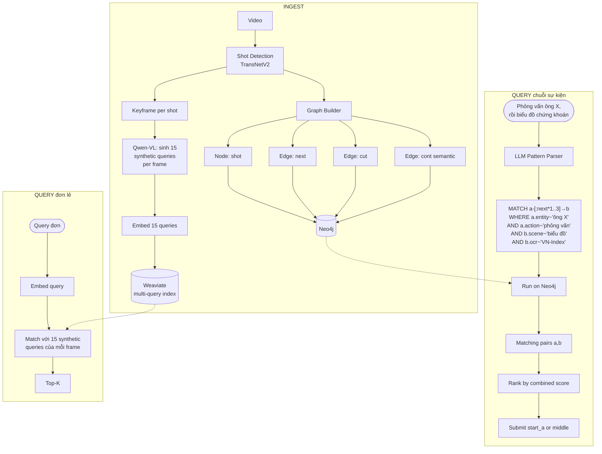

**Các bước:**
1. **Ingest part A — Synthetic queries**:
   - Mỗi keyframe → Qwen-VL prompt sinh 15 truy vấn theo style operator.
   - Embed 15 query → lưu Weaviate (link cùng frame_id).
   - **Lý do**: query của user khớp với "query-style" tốt hơn caption "description-style".
2. **Ingest part B — Graph**:
   - Shot detection → node trong Neo4j.
   - Edge: next (cùng video, kế tiếp), cut (chuyển cảnh), cont (cosine ≥0.85).
3. **Query đơn lẻ** (right side): khớp query với 15 synthetic → top-K nhanh.
4. **Query chuỗi** (left side): LLM parse query thành **Cypher pattern** → chạy trên Neo4j → trả cặp (a,b) liền nhau.

---

## 12. Combo cuối: BetterDay v2 tổng hợp

> Gộp 3 kiến trúc đề xuất + kế thừa best practices từ RAPID/TycheVid/NewsInsight.

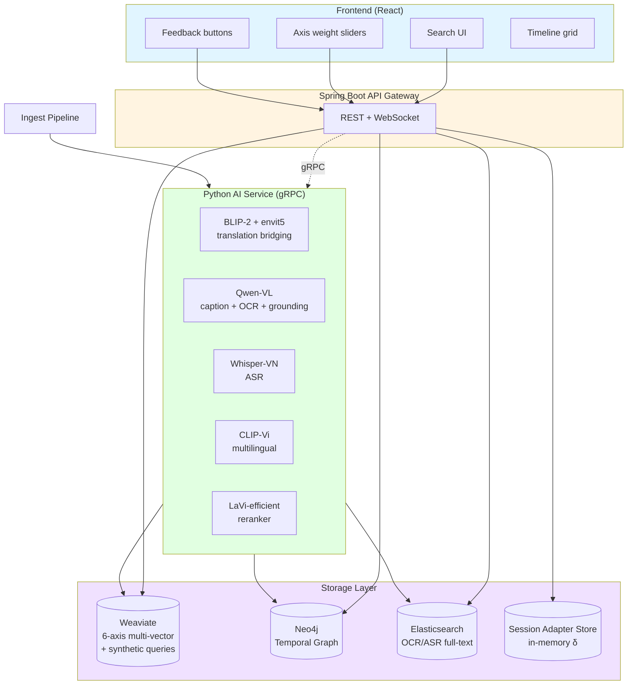

**Các bước hoạt động end-to-end cho 1 query:**

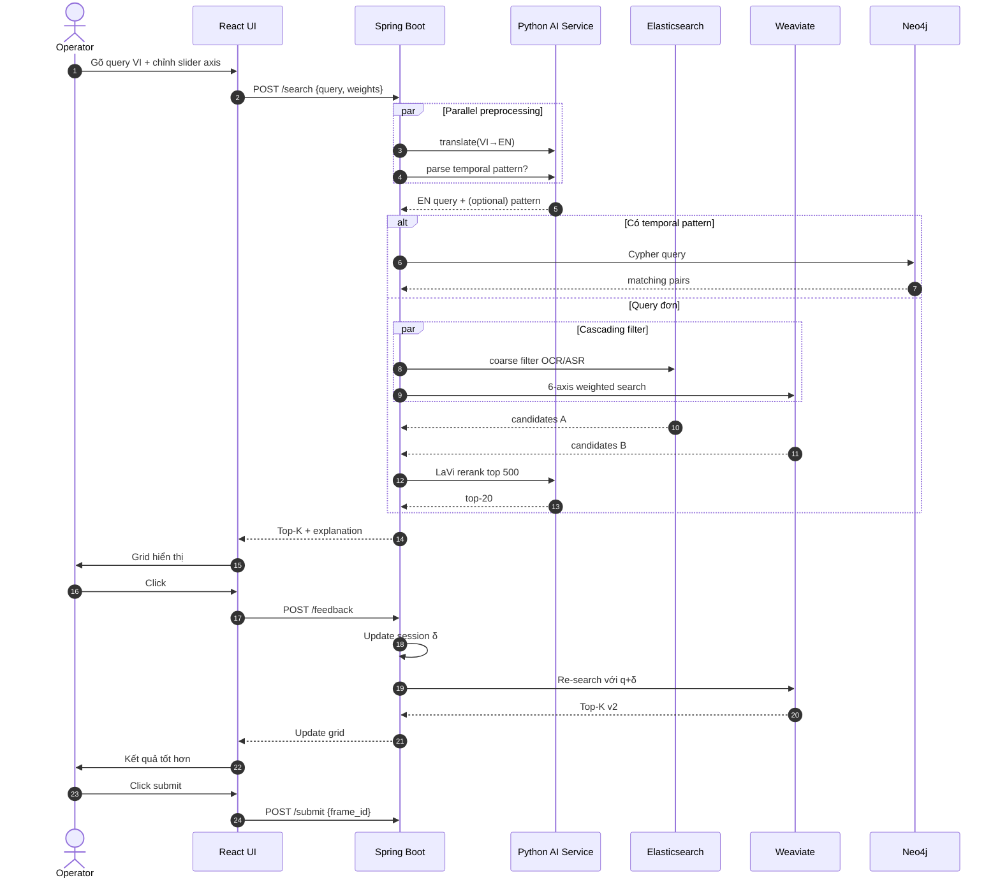

**Các bước (numbered):**
1-2. Operator gõ query + chỉnh slider → gửi lên API.
3-5. Song song: translation bridging + parse temporal pattern (nếu có).
6-9. **Nếu temporal**: query Neo4j; **nếu đơn**: cascading filter (ES coarse + Weaviate dense).
10-11. LaVi rerank → top-20.
12-13. UI hiển thị + giải thích.
14-17. Operator click feedback → update δ → re-search nhanh.
18-19. Submit khi đúng.

---

## Ghi chú render Mermaid

- **GitHub**: tự động render khi mở file `.md`.
- **VSCode**: cài extension *Markdown Preview Mermaid Support*.
- **Obsidian**: render native.
- **Online**: paste vào https://mermaid.live để chỉnh sửa.

## Bảng tham chiếu nhanh

| Đội/Kiến trúc | Năm | Stack chính | Đặc trưng |
|---|---|---|---|
| DoppelSearch | 2023 | CLIP + Faiss | Baseline đơn giản |
| Vi-ATISO | 2023 | CLIP+BEiT-3, CLIP2Video, VFNet, OCR | 4 microservice |
| NaiveNotNice | 2024 | CLIP + OCR + ASR + caption + object | Multi-model ensemble |
| NewsInsight 2.0 | 2024 | BLIP + ES + LLM optimizer | 2-stage filter + LLM |
| VizQuest | 2024 | Visual+Audio+Text fusion + temporal | Top 10 |
| SnapSeek | 2024 | Milvus + ES + context news | Context-aware |
| RAPID | 2024 | BLIP-2 + envit5 + YOLOWorldv2 + KPI | Translation bridging, SOICT'24 |
| TycheVid | 2024 | Vector DB + HNSW tuned | Giải Nhất, speed-first |
| **DMAR** | 2026 | 6-axis disentangled | Đề xuất, axis sliders |
| **Session Adapter** | 2026 | Online gradient δ | Đề xuất, neural feedback |
| **Temporal Event Graph** | 2026 | Neo4j + synthetic queries | Đề xuất, chuỗi sự kiện |
