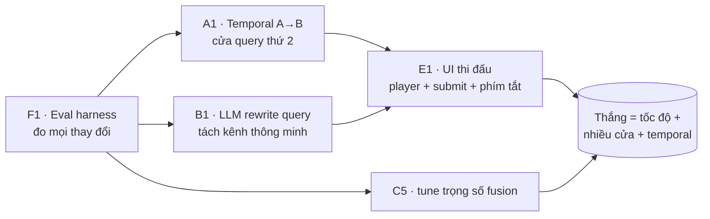

# Kiến trúc & nguyên tắc thiết kế — định hướng cuộc thi

> **File này là gì:** mô tả FUFU ở mức **hợp đồng (contract) & nguyên tắc** — thứ *không nên đổi* —
> tách khỏi **bản triển khai hiện tại** (model nào, DB nào) — thứ *sẽ đổi nhiều* khi chuẩn bị thi.
>
> **Đọc cùng:**
> - [PROJECT-CONTEXT.md](PROJECT-CONTEXT.md) = hệ thống **như code đang chạy bây giờ** (bản triển khai *tạm thời*).
> - [RESEARCH-PLAN.md](RESEARCH-PLAN.md) = **menu ý tưởng** nâng cấp (hướng tiến hoá).
> - File này = **lớp ở giữa**: cái khung giữ nguyên khi ta thay ruột.
>
> **Vì sao cần file này:** kiến trúc hiện tại (1 encoder SigLIP, SQLite+FAISS, fusion 3 kênh)
> **gần như chắc chắn sẽ thay đổi** cho cuộc thi (ensemble encoder, temporal, có thể đổi sang
> Milvus/Elasticsearch, thêm cửa truy vấn…). Nếu team chỉ đọc PROJECT-CONTEXT thì dễ tưởng
> "đây là cách duy nhất". File này nói rõ: **chỉ cần giữ contract, mọi ruột bên trong thay được.**

---

## 1. Một câu về bài toán (không phụ thuộc kiến trúc)

> Cho **một kho media lớn** (video + audio + ảnh) và một **mô tả ngôn ngữ tự nhiên** (thường tiếng Việt),
> trả về **danh sách đoạn (media + mốc thời gian)** xếp theo độ liên quan, đủ nhanh để operator nhảy
> tới đúng cảnh và **submit** trong vài giây.

Mọi quyết định kỹ thuật phục vụ đúng câu trên. Khi phân vân "có nên làm X không", hỏi: *X có giúp
operator tìm & submit đúng cảnh nhanh hơn không?*

---

## 2. Bốn nguyên tắc giữ xuyên suốt

Đây là các nguyên tắc **không đổi kể cả khi thay toàn bộ model/DB**:

| # | Nguyên tắc | Hệ quả thực tế |
|---|---|---|
| **P1** | **Tách tầng theo contract** (extractor / index / query / UI rời nhau, nói chuyện qua dữ liệu chuẩn) | Thay 1 model không được buộc sửa 3 tầng kia. Mỗi tầng test được độc lập. |
| **P2** | **Eval-driven** — không merge thay đổi nào mà chưa đo recall@k trước/sau | Mọi tuning là số liệu, không phải cảm tính. Xem [RESEARCH-PLAN F1](RESEARCH-PLAN.md). |
| **P3** | **Nhiều "cửa" truy vấn bổ trợ, hợp nhất có trọng số** (dense + text + …), không đặt cược 1 kênh | Cảnh chỉ phân biệt qua chữ/lời/ảnh đều bắt được. Thêm cửa mới = thêm 1 nguồn điểm vào fusion. |
| **P4** | **"Segment" là đơn vị nhảy-đến** — kết quả luôn quy về (media, start, end) | Dù index theo frame/shot/scene gì, đầu ra cuối luôn là đoạn submit được. |

> 🔑 Nếu một đề xuất phá vỡ P1–P4, dừng lại và bàn — đó là thay đổi *kiến trúc*, không phải *tinh chỉnh*.

---

## 3. Các hợp đồng (contracts) — phần ổn định

Mô tả input/output từng tầng **bằng dữ liệu, không bằng tên model**. Miễn là một implementation
nhận đúng input và trả đúng output, nó **cắm vào được** mà không sửa tầng khác.

### 3.1 Ingest contract

```
INPUT : 1 file media (video | audio | image)
OUTPUT: ghi vào index 4 loại "tài sản" sau, đồng bộ với nhau:
  • segments[]    : đơn vị nhảy-đến  → (media_id, start_sec, end_sec)
  • frames[]      : keyframe         → (timestamp, embedding[d], thumbnail) ; thuộc ≥1 segment
  • annotations[] : kênh text của frame → {ocr, caption, objects, ...}  (mở rộng tự do)
  • transcript[]  : lời thoại        → (start, end, text) ; gán về segment theo overlap
```

**Bất biến:** mọi vector trong index phải có hàng metadata tương ứng (đừng thêm vector "mồ côi").
Vector đã chuẩn hoá để dùng cosine/inner-product.

*Hiện thực bây giờ (tạm):* PySceneDetect cắt shot → keyframe 1/s → SigLIP embed → EasyOCR/Qwen-VL/YOLO-World annotate → PhoWhisper ASR. **Tất cả phần in nghiêng này thay được.**

### 3.2 Index contract

```
Cần 3 khả năng tra cứu (3 store logic, có thể chung 1 CSDL hoặc tách):
  • DENSE   : cho 1 vector query → top-K frame gần nhất (ANN)
  • TEXT    : cho token query → top-K theo BM25/full-text (trên annotation & transcript)
  • META    : lọc/lấy thuộc tính (thời gian, vị trí, object, scene…) + map frame→segment→item
```

*Hiện thực bây giờ (tạm):* FAISS HNSW (dense) + SQLite FTS5 ×2 (text) + SQLite (meta).
*Có thể đổi:* Milvus/Qdrant cho dense, Elasticsearch cho text VN, graph DB cho quan hệ — xem [RESEARCH-PLAN D3](RESEARCH-PLAN.md).

### 3.3 Query contract

```
INPUT : query ngôn ngữ tự nhiên (+ tuỳ chọn: ảnh mẫu, filter, phần temporal A<B)
PIPE  : expand → retrieve đa kênh → fuse (có trọng số) → rerank → aggregate về segment
OUTPUT: ranked segments[] = [(media, start, end, score, score_breakdown, best_frame, best_asr)]
```

**Bất biến:** đầu ra luôn kèm `score_breakdown` (điểm từng kênh) và đủ thông tin để hiển thị +
nhảy đến + submit. Đây là thứ UI và eval dựa vào — **giữ ổn định** kể cả khi đổi cách tính điểm.

### 3.4 UI / API contract

UI chỉ biết Query contract (§3.3). Đổi backend (model, fusion, thêm kênh) mà giữ nguyên shape
JSON kết quả thì **UI không phải sửa**. Ngược lại, thêm trường mới → thêm *optional*, đừng phá trường cũ.

---

## 4. Cái gì TẠM THỜI vs cái gì NÊN GIỮ

Bảng này để team biết **được phép đập đi cái gì** mà không sợ phá hệ:

| Thành phần | Trạng thái | Ghi chú |
|---|---|---|
| Contract §3 (ingest/index/query/UI) | 🟢 **GIỮ** | Đổi cái này = đổi kiến trúc, phải bàn cả team |
| 4 nguyên tắc P1–P4 (§2) | 🟢 **GIỮ** | |
| "segment = đơn vị nhảy-đến" | 🟢 **GIỮ** | |
| Model encoder (SigLIP-2 Large) | 🟡 **dễ đổi** | Có thể đổi checkpoint / thêm encoder thứ 2 (ensemble) — [C1](RESEARCH-PLAN.md) |
| OCR / Caption / ASR / Detection cụ thể | 🟡 **dễ đổi** | EasyOCR→Gemini/Paddle, v.v. — [D2](RESEARCH-PLAN.md) |
| Vector DB & text store (FAISS+SQLite) | 🟡 **dễ đổi** | Miễn giữ Index contract §3.2 |
| Trọng số fusion `{dense, bm25_visual, bm25_asr}` | 🔴 **phải tune** | Giá trị hiện tại CHƯA kiểm chứng — tune bằng eval [C5](RESEARCH-PLAN.md) |
| Cách cắt segment (shot/scene/cửa sổ) | 🟡 **dễ đổi** | Miễn đầu ra vẫn là (media, start, end) |
| Chỉ-1-kênh-dense, không temporal | 🔴 **sẽ thay** | Khoảng trống lớn nhất — nhóm A/B/C của RESEARCH-PLAN |

> Quy ước màu: 🟢 giữ · 🟡 thay tự do sau khi giữ contract · 🔴 biết là phải đổi/tune.

---

## 5. Hướng tiến hoá cho cuộc thi (bản đồ, không phải cam kết)

Thứ tự ưu tiên rút ra từ [RESEARCH-PLAN](RESEARCH-PLAN.md) (kỹ thuật đội thắng VBS/AIC):



- **Làm trước hết:** F1 (eval) — không có nó thì mọi tinh chỉnh là mò.
- **Ba ROI cao nhất:** F1 + A1 (temporal) + B1 (query rewrite).
- Các "cửa" truy vấn có thể thêm dần (sketch, query-by-image, SOM browsing…) — mỗi cửa chỉ là
  **một nguồn điểm mới vào fusion** (P3), không phá contract. Xem [RESEARCH-PLAN §1.4](RESEARCH-PLAN.md).

---

## 6. Quy tắc khi refactor (để không vỡ trận)

1. **Xác định mình đang đổi tầng nào** (§3) và **có giữ contract không**. Nếu phá contract → bàn cả team trước.
2. **Đo baseline bằng eval (F1) trước khi sửa**, ghi số.
3. Sửa → **chạy lại eval** → so sánh. Không merge thứ làm giảm recall@5 hoặc đẩy latency >1s.
4. Nếu đổi hành vi/luồng/tham số mặc định → **cập nhật [PROJECT-CONTEXT.md](PROJECT-CONTEXT.md)** (và file này nếu đổi contract).
5. Giữ đầu ra Query contract (§3.3) ổn định để **UI và eval không phải chạy theo**.

> **Tóm tắt một dòng:** *PROJECT-CONTEXT mô tả "ruột" hôm nay; file này mô tả "khung" lâu dài. Thay ruột thoải mái — đừng đụng khung mà chưa bàn.*
